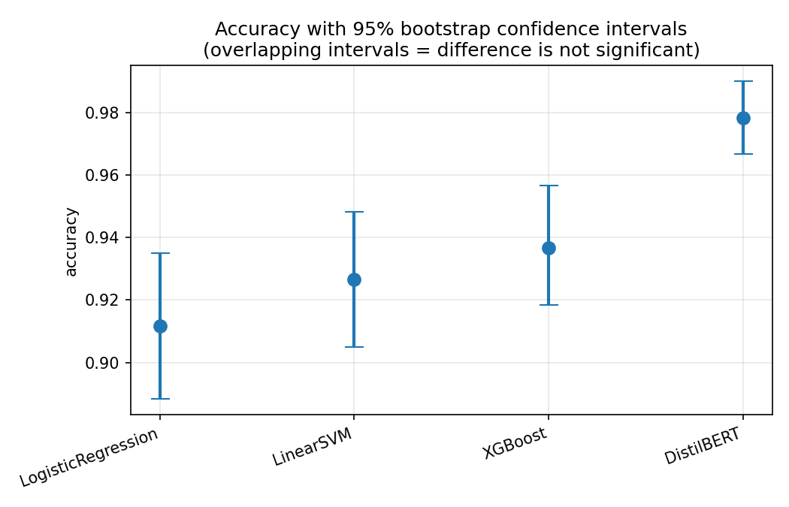
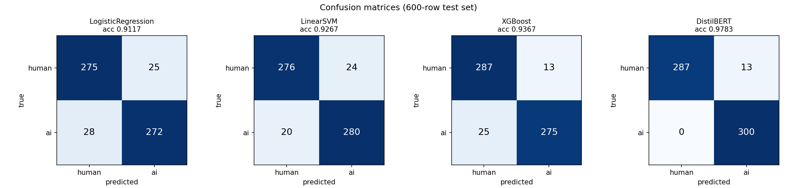
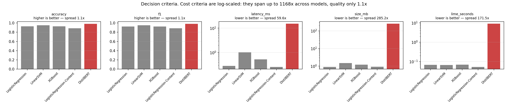
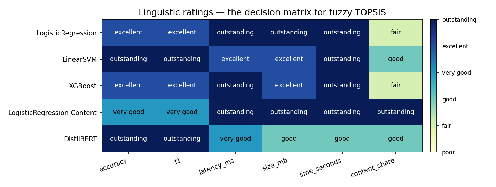
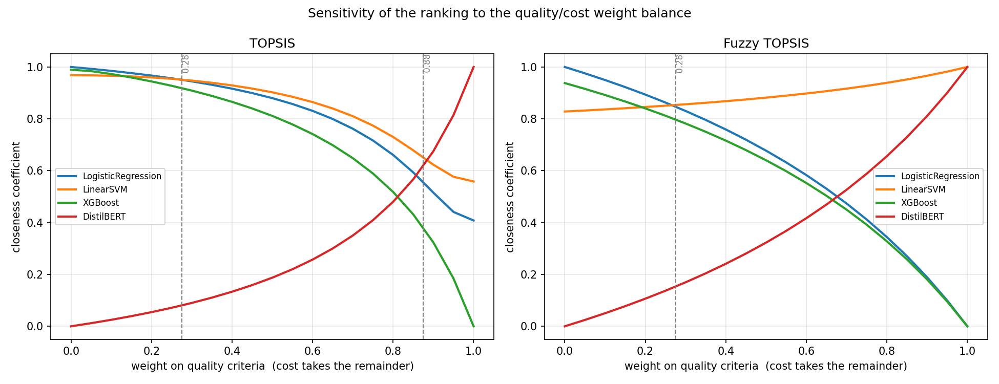

# Human vs. AI-Generated Text: Classification, Model Selection, and Explanation

**CSE710 — Advanced Artificial Intelligence**

A binary text classifier distinguishing human-written from AI-generated writing,
in which the deployed model is chosen by multi-criteria decision analysis and
its individual predictions are explained with LIME.

Every figure in this report is produced by the scripts in this repository.

---

## 1. Problem and dataset

The task is to classify a passage of text as human-written (label 0) or
AI-generated (label 1).

**Source.** HC3, the Human-ChatGPT Comparison Corpus (Guo et al., 2023),
obtained from the Hugging Face distribution. Each HC3 record pairs a question
with a list of human answers and a list of ChatGPT answers.

**Construction** (`src/data_prep.py`):

1. **Flatten** — every individual answer becomes its own row, labelled by
   origin. Answers are never concatenated, so each row is one author's complete
   response to one question.
2. **Clean** — strip whitespace, drop empty and null rows.
3. **Balance** — sample 1,500 rows per class, then shuffle. A balanced set makes
   accuracy directly interpretable and removes any majority-class prior.
4. **Remove placeholders** — strip `URL_n` tokens (see below).
5. **Split** — 80/20 stratified, `random_state=42`.

**A label leak, found and removed.** HC3 replaced hyperlinks in human answers
with placeholder tokens `URL_0`, `URL_1`, … . Reddit and StackExchange answers
contain links; ChatGPT answers do not. The token therefore appears in **12.9% of
human rows and 0.1% of AI rows** — 195 rows, 310 occurrences — and identifies a
text as human with near-certainty for reasons unrelated to writing style. In an
earlier revision `url_0` was the second-strongest human-ward coefficient in the
baseline model.

`data_prep.py` now strips `\bURL_\d+\b` from the splits before training, leaving
non-matching text byte-identical and emptying no rows, so the class balance and
the seeded split are unchanged. Removing it costs the baseline about half an
accuracy point — the honest price of a number that was previously inflated by a
preprocessing artifact. `data/dataset.csv` retains the raw text as an archive.

| | rows |
|---|---|
| Full dataset | 3,000 (1,500 human / 1,500 AI) |
| Train | 2,400 |
| Test | 600 (300 human / 300 AI) |

Mean text length is roughly 865 characters. These are long-form answers rather
than single sentences, which matters for interpreting the out-of-distribution
behaviour discussed in §5.6.

**A caveat, stated up front.** The pipeline does not deduplicate, so
near-duplicate HC3 answers may fall on both sides of the split. This inflates
every model's score by a similar amount, leaving the comparison and the ranking
fair, but the absolute accuracies below should be read as optimistic.

---

## 2. Candidate models

Four candidates and one ablation, all trained and evaluated on the identical
split.

| Model | Representation | Classifier |
|---|---|---|
| Logistic Regression | TF-IDF, 1–2 grams, 20,000 features, sublinear TF | linear, `max_iter=1000` |
| Linear SVM | same TF-IDF | `LinearSVC` + `CalibratedClassifierCV(cv=5)` |
| XGBoost | same TF-IDF | 300 trees, depth 6, learning rate 0.1 |
| DistilBERT | learned word-piece embeddings | fine-tuned transformer |
| *LogReg-Content* (ablation) | *same TF-IDF, `stop_words="english"`* | *linear, `max_iter=1000`* |

The classical models share an identical TF-IDF front end (`train.build_vectorizer`),
so any difference between them arises from the learning algorithm rather than
from different features.

**Feature settings.** 20,000 features rather than 5,000: at the smaller budget,
bigrams consumed roughly half the vocabulary and domain vocabulary was excluded
outright — of the words in a sample passage about regression, *every* content
term (`regression`, `variable`, `predictor`, `dependent`, `outcome`) was absent
from the vocabulary, so the model could not use them and LIME could not
attribute to them. `sublinear_tf=True` replaces raw term frequency with
1 + log(tf), so a word repeated eight times in a passage no longer dominates on
repetition alone.

**The ablation.** `LogReg-Content` is the baseline with function words removed
at the feature level. It is measured and reported but **excluded from the
ranking**: it scores ~100% on the `content_share` criterion by construction, so
ranking it would measure how it was built rather than how good it is. Its role
is to price the tradeoff (§5.5).

**The transformer.** DistilBERT (Sanh et al., 2019) is a distilled six-layer,
~66M-parameter model. Two properties separate it categorically from the
bag-of-words classifiers. *Self-attention* builds each token's representation
from the entire surrounding passage, so a phrase is read in context rather than
as independent unigrams; the TF-IDF models cannot see word order at all.
*Transfer learning* means the model arrives already knowing English from
large-scale pretraining, and fine-tuning only adapts it — which is why 2,400
training rows suffice, where a network of this size trained from scratch on that
data would not converge.

Fine-tuning: 3 epochs, learning rate 2e-5, batch size 16, `seed=42`, maximum
sequence length 256 tokens. Training took 6 min 51 s on an Apple M4 using the
MPS backend, with training loss falling from approximately 0.42 to 0.0039.

**A note on the SVM.** `LinearSVC` exposes only `decision_function`, an unbounded
signed distance from the separating hyperplane, not probabilities. LIME requires
a function returning class probabilities, and the demo prints a confidence, so
the SVM is wrapped in `CalibratedClassifierCV`, which fits a calibration curve
mapping distances onto probabilities.

---

## 3. Classification results

All figures on the 600-row held-out test set.

| Model | Accuracy | F1 | Sensitivity | Specificity |
|---|---|---|---|---|
| Logistic Regression | 0.9267 | 0.9254 | 0.9100 | 0.9433 |
| Linear SVM | 0.9517 | 0.9521 | 0.9600 | 0.9433 |
| XGBoost | 0.9267 | 0.9236 | 0.8867 | 0.9667 |
| **DistilBERT** | **0.9817** | **0.9820** | **1.0000** | 0.9633 |
| *LogReg-Content* (ablation) | *0.8867* | *0.8863* | *0.8833* | *0.8900* |

Sensitivity is recall of the AI class; specificity is recall of the human class.



**95% bootstrap confidence intervals** (1,000 resamples of the test set):

| Model | Accuracy 95% CI |
|---|---|
| Logistic Regression | [0.9050, 0.9467] |
| Linear SVM | [0.9350, 0.9683] |
| XGBoost | [0.9050, 0.9467] |
| DistilBERT | [0.9700, 0.9917] |
| *LogReg-Content* | *[0.8616, 0.9100]* |

The intervals decide which gaps are real. Logistic Regression and XGBoost have
identical accuracy and overlapping intervals, and Linear SVM overlaps both, so
the ordering among the three is not meaningful on a test set this size.
DistilBERT's interval is disjoint from all of them, so its advantage is genuine
rather than sampling noise.



DistilBERT's error profile is asymmetric and worth noting: it missed **none** of
the 300 AI texts, and all 11 of its errors were human writing filed as AI. In a
plagiarism-detection setting that is the more damaging direction — a false
accusation — even though it produces the best headline accuracy.

The three TF-IDF candidates split the error budget differently: XGBoost is the
most conservative about accusing (specificity 0.9667, 10 false accusations) but
misses the most AI text (sensitivity 0.8867); Linear SVM is the most balanced.

---

## 4. Multi-criteria model selection

### 4.1 Why accuracy alone cannot decide

An obvious approach is to rank the models on Accuracy, F1, Sensitivity and
Specificity. On this dataset that would be a **degenerate** multi-criteria
problem. The test set is exactly balanced at 300/300, so

```
Accuracy = (Sensitivity + Specificity) / 2
```

holds identically, not approximately — confirmed on the baseline:
(0.9100 + 0.9433) / 2 = 0.9267. F1 tracks the same underlying quantities. Those
four criteria are one dimension wearing four hats, and ranking on them
reproduces the accuracy ordering with extra arithmetic.

The criteria that genuinely conflict are the ones a results table usually omits
(`src/benchmark.py`):

| Model | Accuracy | F1 | Latency (ms) | Size (MB) | LIME time (s) | Content share |
|---|---|---|---|---|---|---|
| Logistic Regression | 0.9267 | 0.9254 | 0.28 | 0.90 | 0.07 | 28.4% |
| Linear SVM | 0.9517 | 0.9521 | 1.03 | 1.51 | 0.07 | 32.5% |
| XGBoost | 0.9267 | 0.9236 | 0.53 | 1.22 | 0.07 | 17.1% |
| DistilBERT | 0.9817 | 0.9820 | 15.23 | 256.33 | 9.01 | 44.6% |
| *LogReg-Content* | *0.8867* | *0.8863* | *0.26* | *0.93* | *0.05* | *99.9%* |

DistilBERT is the most accurate model and simultaneously **54× slower**,
**285× larger** and **133× more expensive to explain**. No model is best on
everything, which is the precondition for a multi-criteria method to be doing
real work.



The figure shows the shape of the decision at a glance: the quality panels are
nearly flat across models, while the cost panels — all log-scaled — have
DistilBERT towering over the rest.

Latency is measured one text at a time rather than batched, because the demo and
the explainer classify single inputs; that is the latency a user experiences.

**Explanation content share.** Two criteria concern explanation, and they
measure different things. LIME time is a cost; `content_share` is a quality. It
is the percentage of explanation weight carried by words that are not English
stop words, averaged over ten test passages — how much of an explanation a
reader can act on. An explanation reading `and +0.27, the +0.18, is +0.21` is
produced just as quickly as one reading `emissions, sustainable, renewable`, and
tells the reader nothing; timing alone cannot distinguish them. Including it is
what ties the two halves of this project together: in a system whose purpose is
explainable classification, the *quality* of an explanation is a property of the
model, not an implementation detail.

The criterion discriminates across the candidates without being decisive on its
own — XGBoost at 17.1% against DistilBERT's 44.6% is a 2.6× spread — and,
importantly, adding it does not change the winner: Linear SVM ranks first with
or without it. It describes a real dimension rather than manufacturing a result.

### 4.2 Criterion importance

TOPSIS does not derive weights; they are supplied by the decision-maker
(Hwang & Yoon, 1981). That makes the weighting the one genuinely subjective step,
so it is recorded as a linguistic judgement (`src/weights.py`) rather than as
bare decimals:

| Criterion | Importance | TFN | Crisp weight | Rationale |
|---|---|---|---|---|
| accuracy | Very High | (7, 9, 9) | 0.236 | the headline measure of the task |
| f1 | High | (5, 7, 9) | 0.198 | balances the two error directions |
| content_share | High | (5, 7, 9) | 0.198 | a fast explanation made of function words tells the reader nothing |
| latency_ms | Medium | (3, 5, 7) | 0.142 | experienced on every use |
| lime_seconds | Medium | (3, 5, 7) | 0.142 | waiting for the explanation costs as much as waiting for the prediction |
| size_mb | Low | (1, 3, 5) | 0.085 | nothing here targets a constrained device |

`content_share` is rated High rather than Very High: a detector that explains
itself beautifully but classifies poorly is of no use, so accuracy retains
primacy. It is rated above the cost criteria because explanation quality is the
project's stated purpose, not a convenience.

Fuzzy TOPSIS consumes the TFNs directly; crisp TOPSIS uses their centroids
`(l+m+u)/3`, normalised. Deriving both from a single judgement prevents the two
from drifting apart.

**How much the weighting matters: not much.** Re-ranking under three different
schemes leaves the conclusion intact:

| Weighting | TOPSIS | Fuzzy TOPSIS |
|---|---|---|
| Uniform | SVM > LogReg > XGBoost > DistilBERT | SVM > LogReg > XGBoost > DistilBERT |
| Linguistic (adopted) | SVM > LogReg > XGBoost > DistilBERT | SVM > LogReg > XGBoost > DistilBERT |
| Quality-led | SVM > LogReg > XGBoost > DistilBERT | SVM > LogReg > XGBoost > DistilBERT |

Linear SVM ranks first and DistilBERT last under every scheme, and unlike the
previous revision the two methods now agree on the complete ordering.
Demonstrating that the result survives the weighting is a stronger defence than
any argument for one particular set of numbers.

### 4.3 TOPSIS

Vector normalisation, weighting, ideal and anti-ideal solutions, Euclidean
distances, closeness `CC = d⁻/(d⁺+d⁻)`.

| Rank | Model | d⁺ | d⁻ | CC |
|---|---|---|---|---|
| 1 | **Linear SVM** | 0.0382 | 0.2154 | **0.8493** |
| 2 | Logistic Regression | 0.0506 | 0.2174 | 0.8113 |
| 3 | XGBoost | 0.0851 | 0.2131 | 0.7145 |
| 4 | DistilBERT | 0.2146 | 0.0851 | 0.2840 |

The ablation is excluded from this table. Ranked alongside the candidates it
scores a closeness of 0.9479 against Linear SVM's 0.653 — not a narrow win but
an outlier, which is the signature of an alternative that cannot lose on a
criterion. That gap is the reason it is reported rather than ranked.

### 4.4 Fuzzy TOPSIS

Ratings are assigned by comparing each measurement against threshold bands and
looking up the resulting category's triangular fuzzy number (Zadeh, 1965;
Chen, 2000). The scale is built by construction — six categories spread over
0–10, peaks two apart, each triangle spanning one step either side, ends clipped
— giving `poor (0,0,2)` through `outstanding (8,10,10)`. The triangles overlap so
that a value on a band boundary shades between categories rather than jumping.

Accuracy and F1 use conventional percentage bands (>95 outstanding, >90
excellent, >80 very good, …). Latency, size and explanation time are not
percentages, so their bands are a stated assumption recorded in full in
`src/fuzzify.py` — absolute judgements about what each quantity means for an
interactively driven classifier, deliberately not derived from the observed
measurements, so they do not shift when the candidate set changes.

`content_share` is a percentage but not a quality score, so the accuracy bands
do not transfer: 90% accuracy is excellent, whereas an explanation that is 90%
content words is close to ideal. It has its own band table (>90 outstanding, >70
excellent, >50 very good, >30 good, >15 fair), reading 100% as every highlighted
word carrying meaning and below 15% as an explanation made almost entirely of
grammar words.



| Model | accuracy | f1 | latency | size | LIME time | content share |
|---|---|---|---|---|---|---|
| Logistic Regression | excellent | excellent | outstanding | outstanding | outstanding | fair |
| Linear SVM | outstanding | outstanding | excellent | excellent | outstanding | good |
| XGBoost | excellent | excellent | outstanding | excellent | outstanding | fair |
| DistilBERT | outstanding | outstanding | very good | good | good | good |
| *LogReg-Content* | *very good* | *very good* | *outstanding* | *outstanding* | *outstanding* | *outstanding* |

Distances use the vertex metric, and the fuzzy ideal and anti-ideal are computed
as the componentwise maximum and minimum of the weighted matrix per criterion.

| Rank | Model | CC |
|---|---|---|
| 1 | **Linear SVM** | **0.9034** |
| 2 | Logistic Regression | 0.5499 |
| 3 | XGBoost | 0.5214 |
| 4 | DistilBERT | 0.4501 |

Logistic Regression and XGBoost hold identical categories on five of the six
criteria — 0.9267 for both is simply ">90% excellent" — and are separated only
by `size_mb`, where the baseline's 0.90 MB reaches "outstanding" and XGBoost's
1.22 MB falls one band short at "excellent". Both are rated "fair" on
`content_share` alike, so that criterion does not distinguish them here; it is
the size gap that gives Logistic Regression the higher closeness.

### 4.5 What the two methods agree on

The two methods now agree on the **complete ordering**, which was not true of the
previous revision: `SVM > LogReg > XGBoost > DistilBERT` under both. Both rank
**DistilBERT last**. Its accuracy advantage is worth one linguistic category —
excellent to outstanding — while its cost drops it two categories on both size
and explanation time.

**Selected model: Linear SVM.**

This is the substantive finding of the analysis. A measurably better classifier
exists — DistilBERT, by five accuracy points and with a disjoint confidence
interval — and the decision analysis concludes that its cost is not justified in
this setting. That is precisely what a multi-criteria method is for: it makes the
trade-off explicit and auditable instead of leaving it to whoever reads the
accuracy column first.

### 4.6 Sensitivity to the quality/cost balance

Sweeping the weight given to quality criteria from 0 to 1, with cost taking the
remainder:



| Quality weight | TOPSIS winner | Fuzzy TOPSIS winner |
|---|---|---|
| 0.00 – 1.00 | **Linear SVM** | **Linear SVM** |

Linear SVM holds the entire range under both methods — there is no crossover
point. It is the most accurate of the three cheap models and pays almost nothing
for it: 1.03 ms against the baseline's 0.28 ms, both imperceptible, and an
identical 0.07 s to explain. DistilBERT never wins, because at every weighting
its 256 MB and 9 s explanation time outweigh a five-point accuracy gain.

### 4.7 What the ranking is not used for

It selects one model. It does not weight an ensemble. Closeness coefficients rank
alternatives; they are not calibrated probabilities, and once cost criteria are
in the matrix, using them as vote weights would mean treating a model's
cheapness as a reason to trust its verdict.

---

## 5. Explainability

### 5.1 Method

LIME (Ribeiro et al., 2016) explains a single prediction by perturbing the input
— removing words — observing how the output probabilities shift, and fitting a
small local linear model to that behaviour. The linear model's weights become the
word-level importance scores. It is a *local* approximation: an explanation of
one prediction, not a summary of the model.

Scores throughout this report are expressed relative to the AI class, so a
positive weight means the word pushes toward "AI-generated" and a negative one
toward "human", regardless of which class was predicted.

### 5.2 Why a model-agnostic explainer is necessary

For the logistic regression baseline, LIME is arguably redundant: that model's
coefficients can be read off directly, as `src/train.py` does when it prints the
top 15 words per class. Explaining a linear model with a local linear
approximation is close to circular.

For DistilBERT there is no such shortcut. Importance is distributed across 66M
parameters and six layers of attention; no single weight corresponds to a word.
The only way to learn what the model responds to is to probe it from outside —
change the input, observe the output. That is exactly what LIME does, and it is
why the absence of a coefficient-inspection routine for the transformer is not an
omission but the reason the project needs a model-agnostic explainer.

### 5.3 Validating the explanations

An explanation is persuasive by construction: highlighted words read as a reason
whether or not the model used them. Before any explanation is presented, three
properties are measured (`src/validate_lime.py`).

**Faithfulness — the deletion test.** Take the words LIME says support the
predicted class, remove them, and re-classify. If those words are what the model
was using, the predicted-class probability should fall substantially.

**Stability.** LIME samples perturbations, so its output is stochastic. Re-running
each explanation under several seeds and correlating the word weights measures
that variance directly.

**Sharpness.** The magnitude of the largest weight, reported alongside model
confidence.

| Model | Faithfulness (Δ probability) | Sharpness | Stability | Mean confidence |
|---|---|---|---|---|
| Logistic Regression | +0.1511 | 0.0595 | 0.950 | 0.740 |
| **Linear SVM** | **+0.1943** | 0.1114 | **0.932** | 0.979 |
| XGBoost | +0.1989 | 0.1863 | 0.816 | 0.989 |
| DistilBERT | +0.1332 | 0.2452 | 0.544 | 0.999 |
| *LogReg-Content* | *+0.1346* | *0.0646* | *0.997* | *0.654* |

Every model shows a clearly positive probability drop, so LIME is identifying
words the models genuinely use rather than producing plausible noise. The
selected model, Linear SVM, is faithful (+0.1943) and stable (0.932).

**Stability falls as confidence rises.** DistilBERT, at 0.999 mean confidence,
returns explanations that correlate only 0.544 across perturbation seeds — its
word weights move substantially between runs. This corroborates the ranking of
§4 from an independent direction: the transformer is not merely expensive to
explain, its explanations are also the least reproducible.

### 5.4 Where the models disagree

Of eleven demonstration examples, two split the models (`src/compare.py`). The
clearest is:

> *"I appreciate your question and would be happy to help clarify this for you."*

| Model | Prediction | Confidence | Top LIME words |
|---|---|---|---|
| Logistic Regression | Human | 68.2% | would −0.18, help +0.14, and +0.09 |
| Linear SVM | Human | 76.0% | would −0.31, help +0.26, and +0.15 |
| XGBoost | Human | 96.5% | help +0.06, would −0.04, this −0.03 |
| **DistilBERT** | **AI-generated** | **95.2%** | **appreciate +0.29, your +0.19, to +0.13** |

The three bag-of-words models fixate on common function words. DistilBERT keys on
*"appreciate"* and *"your"* — the register of assistant writing. Comparing the two
models on the same two words is the sharpest illustration in the project:

| Word | Logistic Regression | DistilBERT |
|---|---|---|
| appreciate | −0.005 | **+0.286** |
| your | +0.019 | **+0.182** |

For the bag-of-words model these words are statistically inert — weights
indistinguishable from noise, because "appreciate" is not frequent enough in HC3
for TF-IDF to have learned anything about it. For DistilBERT they are the two
strongest pieces of evidence in the sentence. That is contextual representation
doing something a term frequency cannot, and LIME is what makes it visible rather
than a matter of trusting the more accurate model.

The second disagreement is an HC3 passage of encyclopedic biography whose true
label is AI. The three bag-of-words models and the transformer split on it, with
the selected model on the losing side — recorded here because a demonstration set
that only contains cases the chosen model gets right is not evidence of anything.

### 5.5 Confidence and explainability pull against each other

The sharpness column of §5.3 reflects a structural property, not a defect. When a
model outputs 99.9% confidence, removing any single word leaves the probability
essentially unchanged, so the local linear model LIME fits has almost no gradient
to report. The better separated the decision boundary, the less informative the
local explanation becomes. A system that wants both must accept a trade-off
between them.

The stability column shows the same tension ordered almost exactly by
confidence: DistilBERT at 0.999 confidence is the least reproducible (0.544),
while the ablation at 0.654 confidence is the most (0.997).

**A second trade-off: readability against accuracy.** The `content_share` column
of §4.1 shows that between 55% and 83% of every candidate's explanation weight
falls on function words — `the`, `and`, `or`, `is`. The natural assumption is
that this is a defect of the features. It is not. Training the same logistic
regression on each half of the vocabulary separately:

| Input | Accuracy | F1 |
|---|---|---|
| Full text | 0.9267 | 0.9254 |
| Content words only | 0.9050 | 0.9048 |
| Function words only | 0.9017 | 0.8998 |

**The signal is redundantly encoded.** Each half independently carries about 90%
accuracy. Function words are not *more informative* than content words; LIME
favours them because they recur many times per passage, so deleting one shifts
the probability further than deleting a content word appearing once. That is a
mechanical property of LIME's deletion mechanism interacting with term
frequency, not a fact about where the evidence lies.

Because the signal is redundant, the choice is available. The `LogReg-Content`
ablation takes it: identical to the baseline except that function words are
excluded at the feature level, so LIME *cannot* attribute to them.

| | Accuracy | Content share |
|---|---|---|
| Logistic Regression | 0.9267 | 28.4% |
| LogReg-Content | 0.8867 | 99.9% |

Readable explanations cost **4.0 accuracy points**. The comparison is
like-for-like — same pipeline, same split, differing only in `stop_words` — so
the figure isolates the cost of the restriction rather than confounding it with
a change of model class. The same passage explained by each:

| Model | Top LIME words |
|---|---|
| Logistic Regression | `can +0.050, be +0.048, these +0.038, used +0.037, such +0.034` |
| LogReg-Content | `factors +0.044, used +0.038, allows +0.036, make +0.029, example +0.022` |

Its 99.9% `content_share` is definitional, not an achievement, which is why it
is excluded from the ranking (§4.3). Its purpose is to establish the frontier: it
converts "the explanations are mostly function words" from a complaint into a
price.

### 5.6 A confident failure, visible only through the explanation

Given *"As an AI language model, I don't have personal experiences"* — the
canonical AI tell — every model predicts **Human**, DistilBERT at 99.7%
confidence with all LIME weights below 0.002.

The explanation is distributional. HC3's AI class consists of long-form ChatGPT
answers averaging ~865 characters; a short first-person disclaimer resembles
nothing in the training distribution, so the model has no basis for a decision and
defaults confidently to the class that short informal text usually belongs to.

This is a genuine limitation of the pipeline, and LIME is what exposes it: the
near-zero attributions signal that the prediction rests on no identifiable
evidence. A high-confidence prediction with a flat explanation is a warning sign,
and it is visible only because the explanation was computed.

The demonstration set in `src/explain.py` therefore contains both short crafted
sentences and real HC3 excerpts. On in-distribution text the selected model's
peak weights reach 0.03–0.22; on the short sentences they fall to 0.006–0.013.
Running both groups makes the contrast visible rather than leaving it as a claim.

---

## 6. Limitations

1. **No deduplication.** Near-duplicate HC3 answers may straddle the train/test
   split, inflating all scores. The comparison stays fair; the absolute numbers
   are optimistic.
2. **Single-corpus, single-era evaluation.** HC3 is ChatGPT-era text from 2023.
   No Claude, Gemini or Llama output appears, and no model has been tested against
   a writer deliberately trying to evade detection.
3. **Out-of-distribution fragility.** As §5.6 shows, performance on short text
   bears no relation to the headline 0.9817.
4. **LIME is local and stochastic.** Explanations describe one prediction, not
   the model. The seed is fixed for reproducibility, but §5.3 shows the underlying
   variance is real and largest for the most confident model.
5. **`num_samples = 1000`, not LIME's default 5000.** This trades explanation
   fidelity for speed; at 9.0 s per explanation for DistilBERT the default would
   cost roughly 45 s each.
6. **The linguistic scale is coarse by design.** It cannot separate models within
   the same band, which is why crisp TOPSIS decides the final ordering.
7. **Timings are single-machine.** All latency and explanation figures come from
   one Apple M4 using MPS. The ordering would hold elsewhere; the ratios would not.
8. **`content_share` measures composition, not usefulness.** It counts how much
   explanation weight avoids stop words; it cannot tell whether the content words
   selected are the *right* ones. Faithfulness and stability are measured
   separately for that reason, and no single number covers explanation quality.
9. **Other placeholder artifacts may remain.** A scan found only the `URL_n`
   family, but the leak was discovered by inspecting model coefficients rather
   than by any systematic audit, so the absence of others is not established.

---

## 7. Conclusion

Fine-tuning DistilBERT raised accuracy from **0.9267 to 0.9817**, with
non-overlapping confidence intervals and perfect recall on the AI class. It also
cost 54× the latency, 285× the storage and 133× the explanation time, and its
explanations proved the least stable of the candidates.

TOPSIS and fuzzy TOPSIS both rank it last and both rank **Linear SVM** first, in
complete agreement on the ordering. The recommendation survives every weighting
tested and holds across the entire quality/cost sweep without a crossover point.
The most accurate model available is not the one this system should deploy — and
stating that conclusion with its reasoning exposed is the point of the exercise.

Two findings emerged from taking explanation quality seriously enough to measure
it. The first is a **label leak**: HC3's `URL_n` placeholders appear in 12.9% of
human texts and 0.1% of AI texts, and the baseline had learned them. Removing
them costs about half an accuracy point of previously inflated score. The second
is that the classification signal is **redundantly encoded** — content words
alone and function words alone each carry roughly 90% accuracy. LIME's preference
for `the` and `and` therefore reflects how its deletion mechanism interacts with
term frequency, not where the evidence actually lies. Because the signal is
redundant, readable explanations are purchasable, and the ablation prices them at
4.0 accuracy points for a rise in content share from 28.4% to 99.9%.

LIME supplies what accuracy cannot: evidence about *why* a prediction was made.
Validated by a deletion test before being trusted, it showed the transformer
reading register where bag-of-words models could only count function words, it
exposed a confident failure on out-of-distribution input that no test-set metric
would have revealed, and — by making the composition of its own output
measurable — it exposed a preprocessing artifact in the corpus itself.

---

## References

Chen, C.-T. (2000). Extensions of the TOPSIS for group decision-making under
fuzzy environment. *Fuzzy Sets and Systems*, 114(1), 1–9.

Chen, T., & Guestrin, C. (2016). XGBoost: A Scalable Tree Boosting System.
*Proceedings of KDD '16*, 785–794.

Guo, B., Zhang, X., Wang, Z., Jiang, M., Nie, J., Ding, Y., Yue, J., & Wu, Y.
(2023). How Close is ChatGPT to Human Experts? Comparison Corpus, Evaluation, and
Detection. *arXiv:2301.07597*.

Hwang, C.-L., & Yoon, K. (1981). *Multiple Attribute Decision Making: Methods and
Applications*. Springer-Verlag.

Ribeiro, M. T., Singh, S., & Guestrin, C. (2016). "Why Should I Trust You?":
Explaining the Predictions of Any Classifier. *Proceedings of KDD '16*,
1135–1144.

Sanh, V., Debut, L., Chaumond, J., & Wolf, T. (2019). DistilBERT, a distilled
version of BERT: smaller, faster, cheaper and lighter. *arXiv:1910.01108*.

Zadeh, L. A. (1965). Fuzzy sets. *Information and Control*, 8(3), 338–353.

---

## Reproducing

```bash
pip install -r requirements.txt        # plus: brew install libomp
python src/data_prep.py
python src/train.py && python src/train_candidates.py && python src/train_advanced.py
python src/benchmark.py && python src/select_model.py
python src/validate_lime.py && python src/make_figures.py
python src/explain.py --demo && python src/compare.py
```

`python src/topsis.py` verifies the ranking arithmetic against two published
worked examples, independently of any model.
